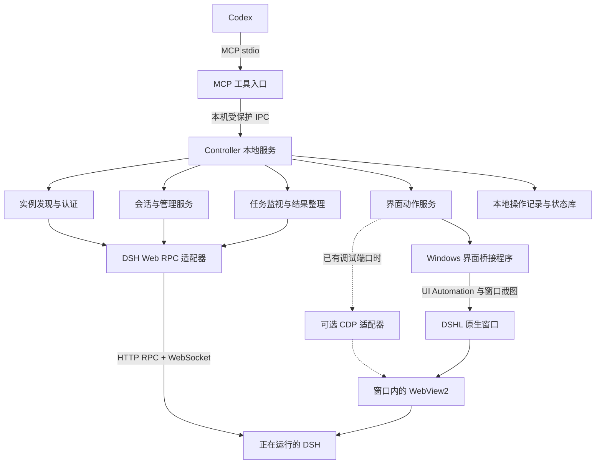

# DSHcontroller 架构方案

日期：2026-10-02。本文件保留初始设计，依据本机 `0.1.7-rc.2` 代码和运行进程核查。第一版已实现，实际能力及未完成项以 [实现与验收记录](IMPLEMENTATION.md) 为准，以下实施阶段描述不表示所有设计能力已经交付。

## 1. 已确定的目标

用户在 Codex 中发出指令，即可控制正在使用的 DSH：创建和继续会话、发送或停止任务、观察子代理、修改模型与配置、管理插件，以及操作 DSHL 原生界面。

已确定的范围：

- 接入现有实例，保留现有会话。
- Codex 通过 MCP 工具直接调用。
- 业务控制与界面控制都需要。
- 界面是 DSHL 独立窗口，内嵌 WebView2。
- 默认策略：普通配置修改直接执行；重启遇到运行中任务时先报告；保存变更与回滚记录。

第一版以 Windows 和指定 DSH 版本为目标。实例端口、配置位置和可用模块通过发现及能力核查确定，不把当前端口写成程序常量。

## 2. 总体结构



MCP 是 Codex 的调用入口。Controller 负责持久连接和动作协调。DSH 仍然是会话、执行状态和配置的事实来源。界面适配器只负责显示状态及用户交互。

多个 Codex 聊天可能分别启动 MCP 进程，因此 MCP 入口保持轻量，连接同一用户下的 Controller。这样不会为每个聊天重复启动 DSH，也不会重复争抢原生窗口。

## 3. 技术选型

| 部分 | 建议实现 | 原因 |
| --- | --- | --- |
| MCP 入口与 Controller | TypeScript + Node.js | DSH 自身使用 JS/TS，便于对照协议和共享运行时校验 |
| MCP 传输 | stdio | 适合本机 Codex；标准输出只写协议，日志写标准错误 |
| Controller IPC | Windows 命名管道，限制当前用户访问 | 无需对外开放控制端口，可供多个 MCP 客户端共用 |
| DSH 业务连接 | HTTP RPC + WebSocket mux | 可接入现有实例，覆盖会话、设置和插件 |
| 原生窗口桥接 | C# / .NET Windows 程序 | 访问窗口句柄、UI Automation、输入及截图 |
| DOM 控制扩展 | Playwright/CDP，按能力启用 | WebView2 已开放调试端口时获得更稳定的网页定位 |
| Controller 状态 | SQLite | 保存操作、任务关联、游标和恢复信息 |
| 本地认证缓存 | Windows DPAPI 保护 | 避免把 Cookie 和启动令牌写进普通日志或状态表 |

具体依赖版本在实现时锁定。第一版不需要额外模型调用：Codex 使用 MCP，任务由 DSH 的现有模型路由执行。

Codex 支持配置本地 stdio MCP 服务；接入配置在项目实现完成后提供。[官方 MCP 文档](https://learn.chatgpt.com/docs/extend/mcp?surface=cli)

## 4. 模块职责

### 4.1 实例发现与身份绑定

发现 DSH 的启动路径、进程、Profile、监听地址及对应的 DSHL 窗口。识别本机多个版本和实例，将它们暴露为不同的 `instanceId`。

当前核查发现指定版本的服务在 `127.0.0.1:10725`，对应 DSHL 窗口标题为 `0.1.7-rc.2 #1（原生） · DSHL`。这些是发现样本，不能作为稳定身份。

绑定记录至少包含：版本目录、Profile、服务进程启动时间、服务地址、窗口所属进程与句柄、连接代次。进程或窗口变化后重新核查，不能仅因旧端口又能连接就认定仍是原实例。

普通 PATH 中的 `dsh` 当前是旧版 `0.1.1-rc.2`。后续启停必须使用发现到的指定版本入口，避免误操作旧版。

### 4.2 认证与能力核查

DSH Web 入口具有启动令牌交换及签名 Cookie 认证。直接访问当前实例的根路径返回 `401`，因此“端口可访问”不能当成“已经接入”。

认证顺序：

1. 使用仍有效的本地认证缓存。
2. 对已绑定实例，从明确的 DSHL 启动记录中提取对应认证 URL，在内存里交换 Cookie。当前日志检测到令牌 URL，但尚未验证能否稳定关联到目标实例。
3. 自动匹配失败时，提供一次性的本地登录入口，让用户粘贴或打开 DSH 的认证 URL；输入不经过 Codex 聊天正文。

校验 Host、Origin、Cookie 和实例绑定，遵循 DSH 自身认证机制。只读取受控来源，不扫描所有日志或浏览器数据，不向 MCP 返回认证材料。

接入后建立能力表，例如 `sessions`、`settings`、`plugins`、`subagentControl`、`nativeUi`、`domUi`。安装目录存在某模块仅证明代码可用；还需确认当前 Profile 实际挂载并能调用。缺失能力返回明确原因。

### 4.3 DSH Web RPC 适配器

封装 `0.1.7-rc.2` 的请求信封、精确参数名、响应校验及流式连接。Controller 业务层不直接拼接 DSH 请求。

- 单次调用走 `/api/<endpoint>`。
- 流式调用走 `/api/remote.mux`。
- 核心调用包括 `session/list`、`session/create`、`session/prompt`、`session/cancel`、`session/follow`、`settings/update` 和插件管理接口。
- 使用独立超时：连接超时、RPC 超时、等待进展超时、任务总时限。
- 保留 DSH 原始错误码和错误信息，同时给出可理解的故障阶段。

SDK stdio 适配器可在以后支持独立实例，但不作为接入现有原生实例的主通道。

### 4.4 会话与任务服务

会话是 DSH 的持久对象；任务是 Controller 对一次发送和后续执行的观察记录。

发消息之前绑定目标会话并订阅或读取基线，生成 `operationId` 和 DSH `requestId`。收到受理响应后，返回 `runId`，供 Codex 后续查询和等待。

需要区分：

- `queue`：加入消息队列。
- `steer`：按 DSH 的当前执行语义插入引导消息。
- “继续”是一条新消息；“停止”是取消执行请求。

第一版提供任务状态：`submitting`、`accepted`、`running`、`waiting_user`、`completed`、`failed`、`interrupted`、`unknown`。这些是 Controller 状态，必须通过实际事件映射；不能用 DSH 的 `idle/running` 两种状态替代全部结论。

返回 `accepted` 只说明请求已受理。必须关联本次用户消息、对应执行边界和最终输出，才能标记完成；不能读取最后一条历史助手消息作为新任务结果。

停止请求同样先返回受理，再观察执行是否结束。断线时标记观察状态未知，恢复后核查 DSH；不能因为网络断开就报告任务失败或已停止。

### 4.5 子代理服务

通过会话投影、子会话和 DSH 子代理控制接口查看父子关系、结果及错误。已有持续型子代理可使用 `subagents/prompt` 和 `subagents/interruptByParent`。

必须带正确的父、子会话身份和模式。一次性与持续型子代理不能套用同一种继续逻辑。创建子代理暂不假定存在通用外部 spawn RPC；先通过原有 DSH 工具或其他已核查接口实现，再公开专门工具。

### 4.6 配置与插件服务

配置读取、修改和验证使用 DSH 当前服务，不直接替换历史 `settings.yaml` 或整份 Profile。

配置更新流程：读取命名空间与 revision → 检查字段 → 保存必要前值 → 使用 `expectedRevision` 更新 → 回读并核查生效状态。

若用户同时在界面修改，revision 冲突就返回冲突，不覆盖用户的新值。回滚只恢复本次改变的字段，且先检查这些字段是否又被修改；不能粗暴恢复整份旧配置。

模型切换区分单会话 `session/selectModel` 和持久默认设置。Provider 与模型目录由 DSH 返回，避免自行推断可用性。密钥字段只返回引用及配置状态；脱敏占位符不能写回为密钥值。

插件使用 `pluginManager/*` 接口管理，保留其 `changed`、`application`、`stage`、错误及警告。`restart-required` 表示已保存但仍需重启，不能报告为运行中已生效。

重启属于实例级协调操作：核查运行中主会话、子代理及安装任务；如存在运行任务，返回具体状态与下一步选择。无人运行且已授权时再执行。由于现有进程由 DSHL 管理，优先通过已核查的 Launcher 控制入口；入口尚未确认时不能直接杀进程并声称正常重启。

### 4.7 原生界面服务

第一版同时提供语义动作与有限底层动作：

- 语义动作：打开指定会话、打开设置页、定位插件页、显示子代理、读取当前页面。
- 底层动作：读取可访问控件、点击、输入、滚动、按键及窗口截图。

Windows 桥接程序使用 UI Automation 读取控件，优先使用 Invoke、Value、Selection 等能力。网页控件是否完整暴露、虚拟列表是否可定位，需在 DSHL 实际验证。

当控件无法访问时，允许基于刚获取的窗口截图执行窗口内坐标动作。动作绑定 `windowId`、`snapshotId`、截图尺寸和 DPI；窗口移动、缩放、导航或快照过期后必须重新获取快照。坐标范围限制在绑定窗口内。

涉及键盘或坐标的动作需要独占 UI 锁并验证焦点。用户同时交互导致前置条件变化时，停止当前自动动作并返回冲突。每个动作后读取新快照或业务状态验证结果，不能以“点击已发送”作为成功依据。

WebView2 已提供调试端口时，可接入 CDP 适配器读取 DOM 并使用语义定位。当前进程命令行没有发现此参数，因此这一能力仍待验证。微软文档说明连接现有 WebView2 的 WebDriver 方案需要在实例创建时配置调试端口。[WebView2 自动化文档](https://learn.microsoft.com/en-us/microsoft-edge/webview2/how-to/webdriver)

初始接入不以重启现有窗口为前提。需要重新启动窗口来启用 CDP 时，作为单独的显式动作，并先核查 DSHL 关闭窗口是否会同时停止后端。

### 4.8 监视、存储与恢复

Controller 保存操作记录、任务关联、最后观察位置、配置字段前值、界面动作结果及必要截图。DSH 会话正文按需读取，不完整复制到另一套存储。

DSH 流事件和即时助手显示帧分别处理；临时 token 流不能冒充持久历史。流重连后依据 opening snapshot 和持久事件 seq 对齐，再按需要补读历史，不假定 `session/follow` 有任意 `since` 参数。

`requestId` 在已检查的代码中用于关联用户消息，尚未证明服务端具备完整去重保证。超时后先检查是否已经受理；无法确定时返回 `unknown`，禁止盲目重复发送。Controller 的幂等记录可防止自己重复调度，但不能宣称远端执行“恰好一次”。

命名管道限定当前用户。桥接进程隐藏启动。MCP 断开只释放该调用，不停止 DSH 或取消业务任务；Controller 重启后重新核查运行状态。

## 5. MCP 工具设计

以下是拟定接口名，不代表已经实现。工具按实例能力注册，明确参数、效果及证据类型。

| 工具 | 主要作用 | 关键参数/结果 |
| --- | --- | --- |
| `dsh_discover` | 发现服务及原生窗口 | 实例列表、版本、Profile、连接状态 |
| `dsh_attach` | 接入选定实例 | `instanceId`，返回能力及认证状态 |
| `dsh_status` | 读取实例状态 | 运行会话、连接代次、界面能力 |
| `dsh_sessions_list` | 查找现有会话 | 分页/搜索、会话 ID 与工作目录 |
| `dsh_session_create` | 创建会话 | 工作目录、Preset，可选模型 |
| `dsh_session_read` | 读取历史与投影 | `sessionId`、消息预算、游标 |
| `dsh_session_send` | 发送或引导任务 | `sessionId`、内容、`queue/steer`；返回 `runId` |
| `dsh_session_stop` | 请求停止当前执行 | `sessionId`；受理及观察状态 |
| `dsh_run_get` | 查本次任务 | `runId`、最终输出、错误及相关事件 |
| `dsh_run_wait` | 有界等待进展 | `runId`、游标、最长 25 秒 |
| `dsh_subagents_list` | 查父子任务 | `parentSessionId`、模式与执行结果 |
| `dsh_subagent_send` | 继续持续型子代理 | 父、子 ID，内容与投递模式 |
| `dsh_subagent_stop` | 请求中断持续型子代理 | 父、子 ID |
| `dsh_models_list` | 查询模型路由 | 来自 DSH 的模型目录 |
| `dsh_model_select` | 修改单会话模型 | 会话 ID、Provider、Model、推理参数 |
| `dsh_settings_get` | 读取配置描述 | 命名空间、revision、脱敏字段 |
| `dsh_settings_update` | 局部修改配置 | 字段补丁、预期 revision；回滚 ID |
| `dsh_change_rollback` | 回滚本次局部变更 | `changeId`；冲突检查结果 |
| `dsh_plugins_list` | 查安装与运行状态 | Bundle、Entry、是否挂载 |
| `dsh_plugin_change` | 安装、启停或移除 | 明确动作与目标；DSH 生效结果 |
| `dsh_instance_restart` | 协调重启 | 实例 ID、运行任务处理策略 |
| `dsh_ui_snapshot` | 查窗口控件与截图 | 窗口身份、快照 ID、可用定位方式 |
| `dsh_ui_open` | 打开会话或指定面板 | 会话 ID 或面板名；界面验证结果 |
| `dsh_ui_action` | 点击、输入、滚动、按键 | 快照 ID、控件/窗口内坐标、动作 |

共用结果包含 `operationId`、`instanceId`、`status`、`data`、`evidence` 和结构化错误。`evidence` 区分接口受理、持久事件、实时投影、控件状态和截图。

工具不要求每次操作确认。需要用户决定时返回具体原因，如运行任务影响重启、配置冲突、目标实例不唯一或认证失效。

## 6. 典型调用流程

### 发任务并让用户在现有窗口看到它

1. Codex 发现并接入实例，选定会话。
2. Controller 建立该会话观察基线。
3. 通过 RPC 发消息，返回受理状态和 `runId`。
4. 界面服务打开同一会话，验证窗口显示正确。
5. Codex 有界等待任务，取得本次执行结果。

业务发送成功而界面切换失败时，报告两个独立结果，继续监视已提交任务。禁止以 UI 点击重试代替失败的 RPC 请求，从而重复发送。

### 修改模型和插件

1. 查询当前模型目录、设置 revision 和插件能力。
2. 按明确范围修改单会话模型或默认设置。
3. 使用插件管理接口执行目标动作。
4. 回读状态；若需重启，显示是否存在运行任务及尚未生效的变化。

## 7. 拟定项目目录

```text
DSHcontroller/
  README.md
  docs/
    ARCHITECTURE.md
    DSH-0.1.7-rc.2.md
  src/
    entrypoints/              # MCP 入口、Controller 启动入口
    mcp/                      # 参数校验、工具注册、响应整理
    core/                     # 实例、会话、任务、配置与界面服务
    adapters/
      dsh-web-v017/            # 当前版本 RPC 与 WebSocket
      dshl-windows/            # 原生桥接客户端
      webview-cdp/             # 可选 DOM 控制
    discovery/                # 进程、Profile、端口、窗口关联
    auth/                     # 认证交换与安全缓存
    ipc/                      # 命名管道、客户端生命周期
    storage/                  # 操作记录、任务映射、恢复
  native/
    DshUiBridge/              # C# UI Automation 与窗口截图
  tests/
    protocol/                 # 精确信封、字段与流状态
    integration/              # 现有实例业务验证
    desktop/                  # DSHL 真窗口验收
  examples/
    codex-mcp.toml            # 完成实现后提供
```

当前只创建文档。其他目录为拟定结构。

## 8. 实施顺序与验收

| 阶段 | 交付 | 验收证据 |
| --- | --- | --- |
| P0 接入可行性 | 发现目标实例、认证、只读列表、UI 快照原型 | 保留现有窗口和会话；真实 RPC 读取与原生窗口截图 |
| P1 核心任务 | MCP + Controller、发送、继续、停止、等待 | 新任务在原有会话出现；按本次请求取回结果；超时不重复发送 |
| P2 原生界面 | 打开会话、面板、点击与输入 | 在真实 DSHL 窗口成功；焦点/DPI/用户并发变化能正确识别 |
| P3 管理功能 | 模型、设置、插件、协调重启 | revision 冲突、局部回滚、重启前运行任务核查、实际生效结果 |
| P4 完整交付 | 持久恢复、多客户端协调、安装与 MCP 示例 | Codex 重连不会取消 DSH；Controller 恢复不重复任务；多个聊天正确共用 |

P0 应同时验证认证和原生界面，尽早确认这两项关键路径。UIA 未覆盖网页核心控件时，先验证截图动作能完成会话导航，再评估 CDP 或 Launcher 桥接扩展。

协议测试和模拟通过只证明适配器行为；必须另外记录当前 DSH 的真实业务验收，以及 DSHL 的实际界面验收。

## 9. 待实现阶段验证的事项

- DSHL 日志中的认证 URL 能否稳定匹配实例并交换有效 Cookie。
- 当前 Profile 是否实际启用已找到的各个 Remote 接口。
- 原生窗口 UIA 是否暴露会话列表、消息输入框、模型选择和设置页控件。
- DSHL 是否已有可调用的启停/重启接口，以及关闭原生窗口对后端的影响。
- 是否能在下一次正常启动时启用 CDP；这不阻塞最初的现有实例 RPC 接入。
- 用户正在编辑同一页面时如何可靠检测 UI 冲突；不能仅靠 Controller 内部锁。

这些问题需要实测解决，不能由安装目录、类型声明或静态检查替代。
