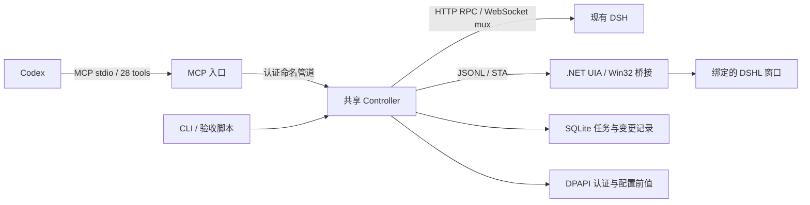

# 第一版实现与验收记录

日期：2026-10-02。目标：Windows 上运行中的 DSH `0.1.7-rc.2` 与 DSHL 原生窗口。以下区分代码实现、离线测试和本机真实运行验收。

## 交付结构

任务先持久化，再发送；Controller 观察 DSH 原有持久事件，使用本次 `requestId` 对应的用户事件与轮次判断完成。断开观察连接只取消观察流，不取消 DSH 执行。实例身份包括 PID、启动时间及本机 URL，窗口通过父进程关系绑定；实例变化后旧 ID 被拒绝。

## 状态表

| 能力 | 当前结果 | 证据与限制 |
| --- | --- | --- |
| MCP 初始化与工具调用 | 真实通过 | SDK 客户端 initialize/listTools/callTool，28 工具 |
| 现有实例发现与认证 | 真实通过 | 当前版本、PID 与启动时间绑定；没有重启 DSH |
| 会话列举、创建、重命名、读取 | 真实通过 | 保留现有会话，新增专用测试会话 |
| 会话内容搜索 | 当前实例禁用 | index `openAt:"never"`；工具降级为标题匹配并标注 searchMode |
| 模型目录与单会话模型选择 | 真实通过 | OpenRouter / Space Bunny / max |
| 发送、观察完成、幂等重试 | 真实通过 | 本次输出 DSHCONTROLLER_OK，最终 completed；复用键不重复提交 |
| 取消任务 | 真实通过 | accepted 后继续观察，最终 interrupted |
| 发送回执丢失后的确认 | 离线通过 | 模拟远端已入队但响应丢失；unknown 后持久事件确认完成，重试不再次发送 |
| 设置读取与脱敏 | 真实读取 / 离线脱敏通过 | 18 命名空间；按字段名及 schema 路径遮蔽凭据 |
| 设置写入和回滚 | 已实现，真实写入待验收 | revision 检查、DPAPI 前值，回滚恢复 user 层或 unset；未修改用户全局设置进行测试 |
| 插件目录读取 | 真实通过 | 10 个 Bundle |
| 插件安装、移除及开关 | Agent Teams 开关已验收；安装和移除待验收 | 区分配置与运行生效；热重载故障及重启后恢复见 AGENT-TEAMS.md 和 PROFILE-RELOAD.md |
| 子代理目录 | 真实读取 | 观察现有父会话的子代理投影 |
| 持续型子代理续发/停止 | 已实现，真实调用待验收 | 要求父子身份；未打断用户现有任务进行测试 |
| 会话分叉 | 已实现，真实调用待验收 | 使用 session/fork 与原有 atSeq 语义 |
| UI 控件与截图 | 真实通过 | UIA 读取约 561 个节点，保存 PNG，已视觉检查 |
| UI 打开插件页 | 真实通过 | 控件 Invoke 后截图确认插件页 |
| UI 按标题打开会话 | 真实通过 | 打开专用测试会话，Document 标题与 PNG 人工视觉核对一致 |
| UI 通用点击/填写/按键/滚动 | 已实现，部分真实验证 | 节点语义动作已执行；键盘、坐标等所有组合尚未逐项验收 |
| 自动重启 DSH | 未实现 | 未核实 Launcher 重启 API，工具报告原因并保留实例 |
| CDP/DOM 控制、外部创建子代理 | 未实现 | 本版提供原生 UIA 路径 |

## 真实任务记录

专用会话：`<test-session-id>`，标题 `DSHcontroller 集成验收`，工作目录为本项目。

成功任务 `<local-record-id>` 使用 `openrouter / stealth/space-bunny-alpha / max`。用户事件 seq 34 与请求 ID 关联，第三轮结束，seq 37，最终 completed，文本为 `DSHCONTROLLER_OK`。相同幂等键返回相同 runId。

停止任务 `<local-record-id>` 在同一专用会话执行。取消回执 accepted:true，随后最终 interrupted。取消受理与实际结束分别记录。

此前默认 DeepSeek 路由返回 HTTP 402 / InsufficientBalance；Space Bunny 首次返回 PI_AI_ERROR / empty response，随后成功。两次失败被关联到正确的新任务，未借用历史输出判定成功。测试提示要求不调用工具、不改文件；没有给用户其他会话发送或停止任务。

本机 `.state/` 中的 live-verification.json、task-verification.json、stop-verification.json、ui-verification.json 分别保存真实 MCP、模型任务、取消与界面检查结果。下一次对应脚本会覆盖报告，本文保存本次关键结论。

Controller 仅新增专用测试会话，未删除历史会话。会话总量属于本机运行快照，不作为验收判据。

UI 验收最终截图为 `.state/screenshots/<snapshot-id>.png`：页面标题与左侧选中会话均为“DSHcontroller 集成验收”，底部显示 Space Bunny Alpha。前期一次搜索使用了被禁用的内容索引，随后发现 TreeItem 名称带状态前缀；这两处适配已修复，最终真实打开通过。通用 ui_open 仍返回 verified:false，调用者必须根据新快照自行验证结果。

## 验证和边界

`npm run build` 成功，TypeScript 与 .NET 构建 0 错误、0 警告；`npm test` 10 项通过。覆盖 RPC 参数与身份关联、错误保持、流取消、任务轮次、无关历史排除、回执丢失与幂等、设置回滚层级及声明密钥脱敏。

独立 MCP 客户端已验证可用。项目级 MCP 配置受信任状态影响；按 README 和 examples/codex-mcp.toml 配置后重新加载客户端。本机专用配置未随源码发布。

UI 快照 90 秒有效，只可用一次。节点名称、类型、AutomationId 与窗口范围重新检查；坐标和键盘路径额外要求截图未变化。窗口移动、最小化或内容更新时需重取快照。已观察到窗口移动时动作被拒绝，没有降低校验强行执行。

设置写入 RPC 回执丢失时可能只有 prepared 记录，不能直接称其未生效，也不能按 applied 回滚。插件写入同样不会自动重发，应先读取 DSH 实际结果。下一阶段应在可控配置或专用实例完成这些写操作的真实验收，再扩展重启、外部子代理创建与 DOM 适配。

Controller 停止后，查询未完成 run 时重新观察已有持久历史；历史回放超出分页上限或身份变化时报告 unknown。`.state/` 中输出与截图并非全部加密；认证、IPC 密钥及设置前值使用 DPAPI，本地工作内容需要按其敏感程度管理。
